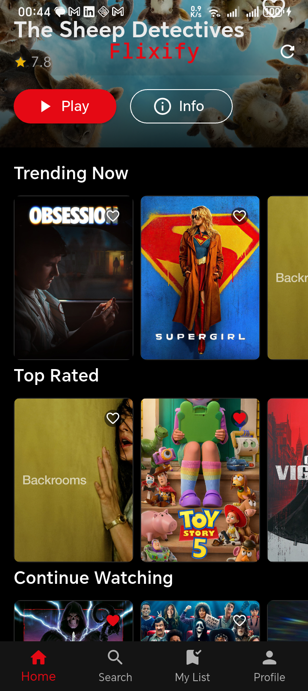
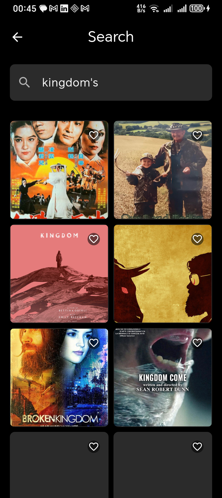
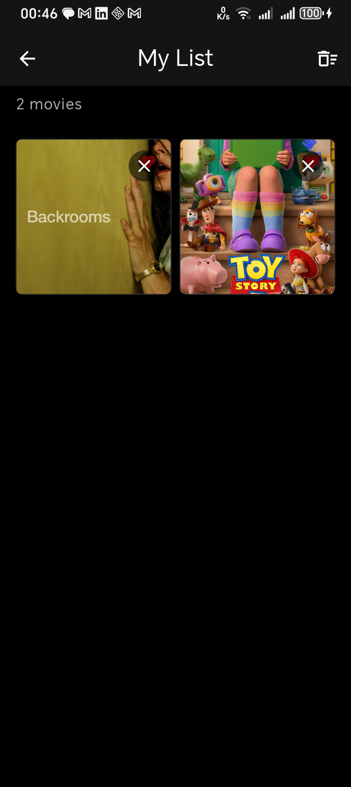

# 🎬 Flixify

> A Netflix-style streaming app built with **Flutter**, **GetX**, and **Firebase**, designed as a comprehensive learning experience for clean architecture, advanced UI patterns, and reactive state management.

<p align="center">
  
</p>

<p align="center">
  <a href="https://flutter.dev"></a>
  <a href="https://dart.dev"></a>
  <a href="https://firebase.google.com"></a>
</p>

---

## ✨ Features

- 🍿 **Browse Movies & TV Shows** using the [TMDB API](https://www.themoviedb.org/documentation/api).
- 🔍 **Search** with real-time debouncing and reactive state updates.
- 📺 **Watch Trailer & Episodes** via an integrated `WebView` (powered by **Vidking**).
- 💾 **Personal Watchlist** synced with Firebase Firestore.
- 📍 **Continue Watching** where you left off, with progress saved to the cloud.
- 🔒 **User Authentication** via Email & Password powered by **Firebase Auth**.
- 📱 **Netflix-like UI** with custom themes, animations, and responsive layouts.

---

## 🏗️ Architecture

This project is built with **Clean Architecture**, making it scalable, testable, and easy to maintain.

```
lib/
├── core/              # Constants, themes, errors, and utilities
├── data/              # Models, Data Sources, and Repository Implementations
├── domain/            # Entities, Abstract Repositories, and Use Cases
└── presentation/      # GetX Controllers, Pages (Screens), and Widgets
```

**Key Principles Applied:**
- ✅ **SOLID** Principles
- ✅ **Dependency Injection** via GetX
- ✅ **Repository Pattern** for data access
- ✅ **Reactive State Management** with `Rx` streams

---

## 🚀 Getting Started

### Prerequisites

- [Flutter SDK](https://docs.flutter.dev/get-started/install) (version 3.12 or higher)
- [Dart SDK](https://dart.dev/get-dart)
- [Android Studio](https://developer.android.com/studio) or [VS Code](https://code.visualstudio.com/)
- A valid [TMDB API Key](https://www.themoviedb.org/settings/api)

### Installation

1. **Clone the repository**

```bash
git clone https://github.com/your-username/flixify.git
cd flixify
```

2. **Install dependencies**

```bash
flutter pub get
```

3. **Configure your API keys**

Create a `.env` file in the root of the project and add your credentials:

```env
TMDB_API_KEY=your_tmdb_api_key_here
TMDB_ACCESS_TOKEN=your_tmdb_access_token_here
# Firebase configuration will be added here in Section 6
```

> **Note:** Never commit your API keys to version control.

4. **Run the app**

```bash
flutter run
```

---

## 📖 Learning Journey

This project is structured as a step-by-step learning experience.

| Section | Topic | Key Concepts |
|---------|-------|-------------|
| **0** | Project Bootstrapping | `pubspec.yaml`, Clean Architecture, Folder Structure |
| **1** | Declarative vs Imperative | `BuildContext`, `setState`, reactive Widgets |
| **2** | Clean Code Architecture | SOLID, Use Cases, Repository Pattern |
| **3** | UI Principles | `Row`, `Column`, `Stack`, `Flexible`, `Expanded`, 7-Number System |
| **4** | GetX State Management | `GetBuilder`, `Obx`, `Rx<T>`, Controllers |
| **5** | Firebase Auth & DB | Auth, Firestore, Real-time Data |
| **6** | WebView & JS Bridge | `JavascriptChannel`, Video Player Events |

> **Ready to start?** Check the [SPRINT.md](SPRINT.md) for detailed progress.

---

## 🔧 Tech Stack

| Category | Technology |
|-----------|------------|
| **Framework** | Flutter |
| **Language** | Dart |
| **State Management** | GetX |
| **Networking** | Dio |
| **Backend** | Firebase (Auth, Firestore) |
| **Video Player** | WebView + Vidking Embed |

---

## 📸 Screenshots

| Home Screen | Details | Player |
|-------------|---------|--------|
|  |  |  |
))| | | |

## 🤝 Contributing

This is a personal learning project. However, if you have suggestions or want to discuss the architecture, feel free to open an issue!

---

## 📄 License

This project is licensed under the MIT License. See the [LICENSE](LICENSE) file for details.

---

<p align="center">
  Built with ❤️ to master <a href="https://flutter.dev">Flutter</a>
</p>
