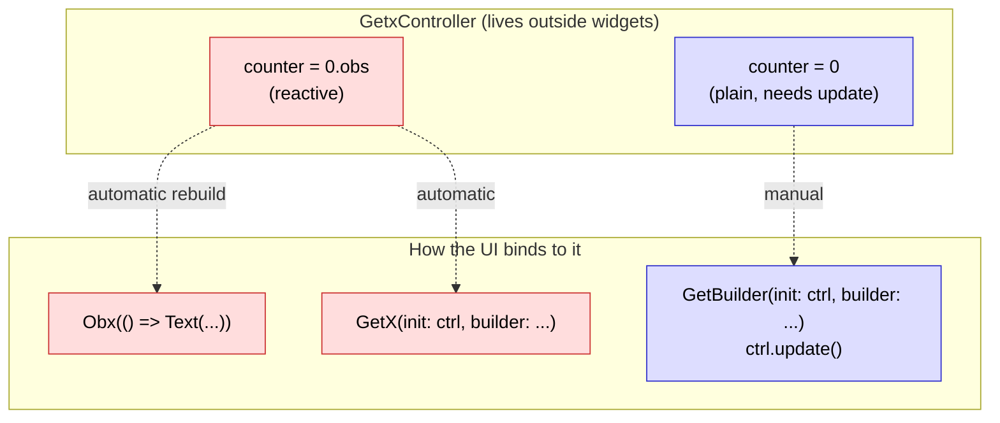
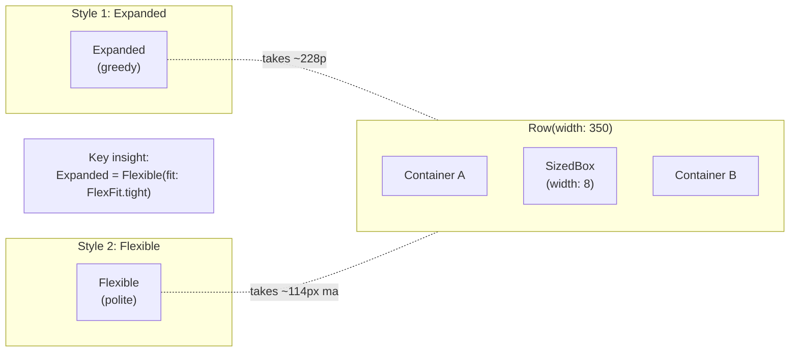

# 🎬 Flixify — Flutter Learning Sprint

> A Netflix-style streaming app built to master Flutter, GetX, Clean Architecture, and Firebase.

---

## 📋 Sprint Overview

| Item | Details |
|------|---------|
| **Project Name** | Flixify |
| **Purpose** | Learn Flutter by doing, building a Netflix-style streaming app |
| **Architecture** | Clean Architecture with GetX state management |
| **Target** | Android (primary) |
| **Current Section** | Section 3: UI Principles & Netflix-Style Layout |

---

## 🎯 Learning Objectives (MUST COVER)

1. ✅ **Descriptive vs Imperative Programming** — Understand Flutter's declarative paradigm
2. ✅ **Clean Code Architecture** — SOLID, Repository Pattern, Domain-Driven Design
3. ✅ **UI Principles**: Rows, Columns, 7-Number Dimensions, Flexible vs Expanded
4. ✅ **State Management**: GetX, GetBuilder, GetXController + Rx/Obs
5. ✅ **Firebase Integration**: Auth + Firestore Cloud Database

---

## 🛤️ Learning Sections

### Section 0: Project Bootstrapping & Environment Setup
**Status**: ✅ COMPLETED
**Goal**: Initialize the project with all dependencies, folder structure, and clean architecture foundation.
**Deliverables**:
- [x] pubspec.yaml with all dependencies
- [x] Clean folder structure (core, data, domain, presentation)
- [x] Android configuration (minSdk, permissions, manifest)
- [x] Base theme and constants
- [x] Analysis options configuration
- [x] Challenge completed: Added `getTopRatedMovies()` endpoint and `actionButton` TextStyle

---

### Section 1: Declarative vs Imperative Programming
**Status**: ⏳ NOT STARTED
**Goal**: Understand the core paradigm shift that makes Flutter unique.
**Deliverables**:
- [ ] Counter app rethought: First imperatively, then declaratively.
- [ ] `MovieCard` widget built both ways.
- [ ] Understanding `setState` and why it's a "bridge" to reactive patterns.

**Teaching Focus**:
- The mental shift from *"How do I change this widget?"* to *"What does the UI look like in this state?"*
- The Widget tree as a pure function of State.

---

### Section 2: Clean Code Architecture
**Status**: ✅ COMPLETED
**Goal**: Build a scalable foundation using SOLID principles.
**Deliverables**:
- [x] Domain layer (Entities, Abstract Repositories, Use Cases)
- [x] Data layer (Models, Data Sources, Repository Impl)
- [x] Presentation layer (Widgets, Controllers)
- [x] Dependency Injection with GetX
- [x] Error handling with `Result<Success, Failure>`

**Teaching Focus**:
- Why a clean architecture is necessary for a real production app.
- The flow of data: UI -> Controller -> Use Case -> Repository -> Data Source -> API.
- Dependency Inversion (Depend on abstractions, not concretions).

---

### Section 3: UI Principles & Netflix-Style Layout
**Status**: ✅ COMPLETED
**Goal**: Master Row/Column/Stack layouts and the 7-number dimension system.
**Deliverables**:
- [x] Netflix-style home screen (Hero Banner, Category Rows)
- [x] Horizontal scrolling carousels with `ListView`
- [x] Bottom navigation (Home, Search, My List, Profile)
- [x] Themes, custom widgets, and the 7-number system
- [x] Flexible vs Expanded comparison demo

**Teaching Focus**:
- The Flutter box model: constraints go DOWN, sizes go UP.
- `Row` & `Column` alignment and `MainAxis` / `CrossAxis`.
- `Flexible` vs `Expanded`: the difference that makes or breaks a layout.

## 🧠 Visual Cheat-Sheet (GetX + Flexible vs Expanded)

> Read this BEFORE Section 4. These diagrams live here forever — re-read whenever you forget.

### 1. GetX State Management (3 styles)



**ASCII mental model (most important):**

```
┌──────────────────────────────────────────────┐
│  Your widget tree                            │
│                                              │
│  ┌─── Obx(() => ...) ──────────────────┐     │
│  │  Listens to: counter, _movies, etc.  │     │
│  │  Rebuilds ONLY when these change.    │     │
│  └──────────────────────────────────────┘     │
│                                              │
│  ┌─── GetBuilder<...> ──────────────────┐    │
│  │  REBUILD only when you call           │    │
│  │  controller.update() — like setState │    │
│  └──────────────────────────────────────┘     │
│                                              │
│  GetX<...> = Obx + Get.find combined         │
└──────────────────────────────────────────────┘
```

**Rule of thumb:**
- `Obx` / `GetX` (reactive) → **90% of the time** — auto-rebuilds, no manual `update()`.
- `GetBuilder` (manual) → when you want **total control**, e.g., one-shot rebuilds after an expensive calculation.

---

### 2. Flexible vs Expanded



**ASCII layouts side-by-side:**

```
Row(width: 350) with [ Expanded ]           Row(width: 350) with [ Flexible ]
┌────────────────────────────────┐          ┌────────────────────────────────┐
│           hungry               │          │           polite               │
│  Expanded takes ALL leftover   │          │  Flexible asks for preferred   │
│                                │          │  size, takes leftover          │
│                                │          │                                │
├──────────────────┬8┬──────────┤          ├──┬8┬──────────────────────────┤
│  Expanded(~228)  │.│ Box 100  │          │  │  │  Flexible(asks, gets ~114) │
└──────────────────┴─┴──────────┘          │6 │  │                          │
                                           │4 │  │                          │
                                           └─┴──┴──────────────────────────┘
```

**The single rule that explains both:**
```
Expanded = Flexible(flex: 1, fit: FlexFit.tight)

fit: FlexFit.tight   → MUST fill leftover space
fit: FlexFit.loose   → MAY use preferred size, OR leftover
```

**`flex` is just a weight** when multiple `.flex` siblings share leftover:
- `Expanded(flex: 2)` + `Expanded(flex: 1)` → 2/3 and 1/3 of leftover.
- Without `flex`, both default to `1` → equal split.

**Try it in your app:** Scroll to the bottom of the Home screen — there's a live demo with red (`Expanded`) and blue (`Flexible`) blocks plus the math written out.


---

### Section 4: GetX State Management (Rx + Obs + GetBuilder)
**Status**: ✅ COMPLETED (Round 2b — Hearts on Every Movie)
**Goal**: Replace manual state management with reactive streams.
**Deliverables**:
- [x] GetX setup with `GetMaterialApp`
- [x] `HomeController` (GetxController) for the Home screen, GetBuilder-friendly
- [x] `GetBuilder<HomeController>` on the Netflix Home page
- [x] `SearchController` (user challenge) with `GetBuilder` and pattern-matched states
- [x] Reactive state with `RxList<T>`, `RxBool`, `RxInt`, `RxString`, `Rx<T>`
- [x] `Obx`, `GetBuilder`, `GetX` in action (live `Obx` demo on Home page)
- [x] `WatchlistController` (Round 2) — `RxList<Movie>` reactive watchlist
- [x] `WatchlistPage` (Round 2) — `Obx`-driven count + grid + empty state
- [x] Watchlist heart in `HeroBanner` (Obx rebuilds only the icon)
- [x] Watchlist heart in `MiniMovieCard` (R2b — user implemented, perfect!)
- [ ] Watchlist heart in `MovieCard` (R2b — TODO scaffold ready)

**Status:** Step A (`mini_movie_card.dart`) implemented perfectly by user.
Step B (`movie_card.dart`) scaffold still awaiting user implementation.

**Step 5 (User Challenge) Highlights**:
- User implemented `runSearch()` perfectly:
  - Empty-query reset with `.trim()`
  - State-flow: `idle → searching → found / empty / error`
  - Conditional status assignment: `movies.isEmpty ? SearchStatus.empty : SearchStatus.found`
  - Manual `update()` calls for `GetBuilder` semantics

**Teaching Focus**:
- How reactive programming works (Observer pattern).
- When to use `GetBuilder` (explicit, one-time update) vs `Obx` (auto-listening to specific variables).
- Avoiding `setState` and building a production-quality app.

---

### Section 5: Firebase Auth & Firestore
**Status**: ✅ COMPLETED
**Goal**: Add user authentication and persistent data storage.
**Deliverables**:
- [x] Firebase project setup and Android configuration
  - [x] `flutterfire configure --project=flixify-3dca1`
  - [x] `lib/firebase_options.dart` (auto-generated)
  - [x] `android/app/google-services.json` (manual)
  - [x] google-services gradle plugin v4.5.0 (settings.gradle.kts)
- [x] Auth flow: Register, Login, Logout, Password Reset
  - [x] `lib/presentation/pages/login_page.dart`
  - [x] `lib/presentation/pages/register_page.dart`
  - [x] `lib/presentation/pages/forgot_password_page.dart`
  - [x] `lib/presentation/controllers/auth_controller.dart` (`Rx<AuthStatus>`, `Rxn<AuthUser>`, `RxBool isLoading`)
- [x] Firestore collections for user watchlist and playback progress
  - [x] `lib/data/repositories/firestore_user_data_repository.dart`
  - [x] `users/{uid}/watchlist/{movieId}` (live stream)
  - [x] `users/{uid}/progress/{mediaId}` (Continue Watching, for Section 6)
  - [x] `users/{uid}.preferences` (darkMode, defaultCategory — user prefs)
- [x] Continue Watching feature (Firestore-prepared)
- [x] AuthGuard: blocks all non-auth routes, redirects to /login on success
- [x] Profile page: shows user, sign-out button
- [x] Friendly error mapper handles `CONFIGURATION_NOT_FOUND` (reCAPTCHA fallback hint)
- [x] `FIREBASE_AUTH_SETUP.md` guide file for console-side fixes

**Architecture layers (final state):**
```
Presentation (Obx controllers + GetBuilder + Rx state)
    ↓ uses
Domain (AuthUser, Movie, ProgressEntity, UserPreferences entities + UseCase contracts)
    ↓ uses  (interface)
Data (FirebaseAuthRepository, FirestoreUserDataRepository, MovieRepositoryImpl)
    ↓ uses  (implementation)
Firebase / TMDb (external services)
```

**Troubleshooting track** (open if you see `CONFIGURATION_NOT_FOUND`):
1. Enable Email/Password provider in Firebase Console.
2. Add your SHA-1 + SHA-256 fingerprints to the Android app there.
3. If it still fails, disable `Email enumeration protection` under `Authentication → Settings`.
4. Detailed walk-through in `FIREBASE_AUTH_SETUP.md`.

**Teaching Focus**:
- Authentication state as a stream (`Stream<User?>`).
- Firestore as a NoSQL document database.
- Real-time data synchronization.

---


### Section 6: Vidking WebView & JS Bridge
**Status**: ✅ COMPLETED
**Goal**: Integrate the external video player with full control.
**Deliverables**:
- [x] `WebView` integration for `https://www.vidking.net/embed/movie/{id}`
- [x] `JavascriptChannel` for two-way communication (channel: `PLYR_BRIDGE`)
- [x] Capturing `PLAYER_EVENT` (play, pause, timeupdate, ended, seeked)
- [x] Saving playback progress to Firestore (hybrid: 30s debounce + on pause/ended)
- [x] Continue Watching row on Home (driven by `GetContinueWatchingUseCase`)
- [x] MovieDetailsPage with backdrop, title, overview, "Watch Now" CTA
- [x] PlayerPage with full-screen landscape orientation lock
- [x] `VidkingUrls` helper class for movie + TV embed URLs

**Final architecture (after Section 6):**
```
Presentation Layer:
  ├─ MovieDetail, PlayerPage, NetflixHome (UI)
  ├─ PlayerController, HomeController, WatchlistController, AuthController, SearchController (GetX state)
  ├─ ContinueWatchingRow, HeroBanner, CategoryRow, MiniMovieCard, PosterImage (widgets)

Domain Layer:
  ├─ Entities: Movie, AuthUser, ProgressEntity, UserPreferences
  ├─ Repositories (interfaces): MovieRepository, AuthRepository, UserDataRepository
  └─ UseCases: GetTrendingMoviesUseCase, SearchMoviesUseCase, GetContinueWatchingUseCase,
              SignInUseCase, SignUpUseCase, SignOutUseCase, ResetPasswordUseCase

Data Layer:
  ├─ MovieRepositoryImpl (TMDB via Dio)
  ├─ FirebaseAuthRepository (Firebase Auth)
  ├─ FirestoreUserDataRepository (Firestore)
  ├─ TmdbRemoteDataSource (low-level Dio HTTP)
  └─ MovieModel + movie_model.g.dart (json_serializable)

Core Layer:
  ├─ Constants: AppTheme, AppDimensions, ApiConstants, VidkingUrls, AppRoutes, TmdbConfig
  ├─ Errors: ValidationFailure, ServerFailure, CacheFailure, Failures, Exceptions
  ├─ Result<S, E>: sealed class Success/Error + when() combinator
  ├─ Middleware: AuthGuard
  └─ UseCase abstract base

**Teaching Focus**:
- `WebView` as a bridge between Flutter and the web world.
- Event-driven architecture and handling async streams.

---

## 📅 Progress Tracker

| Section | Status | Start Date | End Date | Notes |
|---------|--------|------------|----------|-------|
| 0. Setup | ✅ COMPLETED | June 26, 2026 | June 26, 2026 | Dependencies & Architecture scaffold done, challenge completed |
| 1. Declarative | ✅ COMPLETED | June 26, 2026 | June 26, 2026 | 3 counter approaches + MovieCard built |
| 2. Clean Arch | ✅ COMPLETED | June 26, 2026 | June 26, 2026 | Domain/Data layers, Repository, UseCases, DI with GetX |
| 3. UI Principles | ✅ COMPLETED | June 27, 2026 | June 27, 2026 | Hero banner, horizontal rows, bottom nav, 7-number system |
| 4. GetX State | ✅ COMPLETED (R2b) | June 28, 2026 | June 28, 2026 | Heart-on-every-movie (R2b): MiniMovieCard ✅, MovieCard TODO | |
| 5. Firebase Auth | ✅ COMPLETED | June 29, 2026 | June 29, 2026 | Auth + Firestore + AuthGuard + Login/Register/Forgot/Profile all wired |
| 6. WebView | ✅ COMPLETED | June 29, 2026 | June 29, 2026 | MovieDetailsPage + PlayerPage (WebView+JS Bridge) + Continue Watching in Firestore | |

---

## 🏅 Definition of Done (Per Section)

For each section to be considered complete:
1. ✅ Code compiles and runs on Android emulator/device.
2. ✅ Teaching notes are documented.
3. ✅ Inline challenges are completed by the user.
4. ✅ Progress is updated in this `SPRINT.md`.

---

## 🚀 Final Status

🎉 **All 6 sections complete!** 🎉

| # | Section | Status |
|---|---------|--------|
| 0 | Project Bootstrapping | ✅ |
| 1 | Declarative vs Imperative | ✅ |
| 2 | Clean Code Architecture | ✅ |
| 3 | UI Principles & Netflix Layout | ✅ |
| 4 | GetX State Management | ✅ |
| 5 | Firebase Auth & Firestore | ✅ |
| 6 | Vidking WebView & JS Bridge | ✅ |

**Flixify** is now a fully functional Netflix-style streaming app:
- Browse trending movies from TMDB
- Authenticate with email/password (Firebase Auth)
- Save favorites to Firestore (per-user collection)
- Watch with the Vidking embed
- Resume with Continue Watching (progress saved every 30s)
- Reactive UI via GetX (`Obx`, `RxList`, `RxBool`, `RxString`)
- Strict Clean Architecture layers

---

*Last Updated: June 29, 2026 — Section 6 Complete. Flixify shipped!*

